# Rejector

> **Cull bad subframes from your astrophotography session before stacking.**

[](https://dotnet.microsoft.com/)
[](https://www.microsoft.com/windows)
[](LICENSE.txt)
[](CHANGELOG.md)

Rejector loads your FITS and XISF lights, measures the quality of each one (sharpness, star roundness, background, trails, …), shows you the results in one place, and lets you blink through frames to spot satellites, clouds, gusts of wind, and bad seeing at a glance. Frames that fail your thresholds are flagged automatically, and you can move them all to a rejected folder with one click.

The videos are using IMX571 FITS images and are in realtime.


---

## Table of Contents

- [Rejector](#rejector)
  - [Table of Contents](#table-of-contents)
  - [Install \& launch](#install--launch)
  - [Quick start](#quick-start)
  - [The main window](#the-main-window)
    - [The frame list](#the-frame-list)
    - [Status bar \& loading progress](#status-bar--loading-progress)
  - [The preview window](#the-preview-window)
  - [Quality metrics](#quality-metrics)
  - [Automatic rejection](#automatic-rejection)
    - [Per-filter thresholds \& scope selector](#per-filter-thresholds--scope-selector)
  - [Quality score (0–5)](#quality-score-05)
    - [How it works](#how-it-works)
  - [Region of Interest (ROI)](#region-of-interest-roi)
  - [Stretch (Shadows / Midtones / Highlights)](#stretch-shadows--midtones--highlights)
  - [Frame summary \& filter chips](#frame-summary--filter-chips)
    - [Visibility toggles](#visibility-toggles)
    - [Filter chips](#filter-chips)
    - [Sorting](#sorting)
  - [Watch Folder (live mode)](#watch-folder-live-mode)
  - [Moving rejected frames](#moving-rejected-frames)
  - [Saving \& loading sessions](#saving--loading-sessions)
  - [Keyboard shortcuts](#keyboard-shortcuts)
  - [Headless / command-line mode](#headless--command-line-mode)
  - [Notes \& caveats](#notes--caveats)
  - [Requirements](#requirements)
  - [Changelog](#changelog)

---

## Install & launch

1. Download the latest installer from the [Releases page](https://github.com/photon1503/blink-o-mat/releases) and run it.
2. Find **Rejector** in the Windows Start menu and open it.
3. On startup, Rejector silently checks GitHub for a newer version. When one is available, a green banner appears below the toolbar with a **View release** link; dismiss it with **✕** and it will not return until the next launch.

> No internet connection is required to use the program — the update check is fire-and-forget and never blocks the UI.

---

## Quick start 

1. Click  *Input folder* and pick the folder with your light frames.
2. Optionally tick **Subfolders** to scan recursively.
3. Optionally tick **Watch Folder** to keep monitoring the folder after loading — new frames are added and measured automatically as your capture software saves them (see [Watch Folder](#watch-folder-live-mode)).
4. Wait for the status bar to finish loading. Frames appear in the list as soon as each one is measured.
4. Look at the *Frame summary* card on the left to see how many frames passed and how much integration time you have.
5. Click **Open preview** (or double-click any frame) and press `Space` to blink through your session.
6. Tweak the sliders under *Automatic rejection* until the **Rejects: N** counters look right.
7. Click *Rejected folder* and pick a destination.
8. Click **Reject** in the top toolbar, confirm the dialog, and your bad frames are moved.

---

## The main window

The main window is divided into three areas:

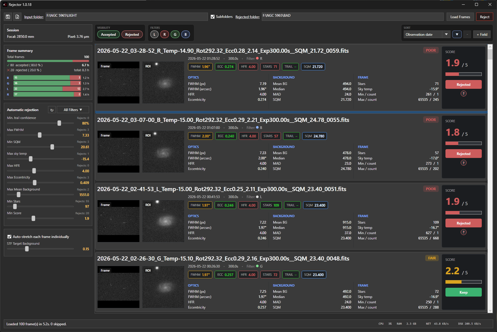

- **Top toolbar** — input/rejected folder pickers, **Subfolders** toggle, **Load Frames**, **Reject** (move bad frames), and **💾 Save Session** / **📂 Load Session** icons in the top-left corner.
- **Above Frame list** - *Visibility*, *Filters*, and *Sort* cards.
- **Left sidebar** — *Frame summary*, *Stretch*, *ROI*, *Automatic rejection*, 
- **Frame list** (right) — one row per frame with thumbnail, ROI preview, metric chips, score, star rating, and a **Reject / Keep** button.
- **Bottom** - status bar and performance indicators

### The frame list

Each row shows:

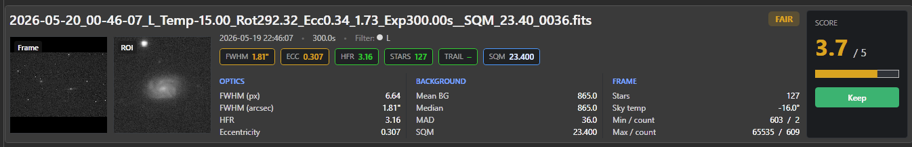

- A **full-frame thumbnail** of the image (stretched and downsampled).
- A **ROI thumbnail** showing a zoom into the most interesting part of the image (see [ROI](#region-of-interest-roi)).
- A row of **colour-coded metric chips** (🟢 / 🟡 / 🔴) relative to the session average.
- The **overall score** as a number (0.0–5.0) and label (**GOOD / FAIR / POOR**).
- A **Reject / Keep** button to flip the verdict manually.
- A small **?** badge on automatically rejected frames — hover it to see exactly which thresholds were violated and by how much.
- A **filename** with full path tooltip; long names are truncated with an ellipsis.

### Status bar & loading progress

While frames are loading, the status bar shows a single live line such as:

```
Loading 47/120 • active: 32 • current: NGC7000_L_001.xisf • skipped: 1
```

The progress bar advances steadily from 0 to 100 % as frames complete, and the UI stays responsive throughout — even with hundreds of frames.

The status bar also shows live **CPU / RAM / Disk / Network** indicators on the right while loading.

When **Watch Folder** mode is active, a blinking red **LIVE** badge appears on the left side of the status bar to indicate that new frames will be picked up automatically.

---

## The preview window

Click **Open preview** in the toolbar (or double-click a frame) to open the preview window for close inspection and blinking.

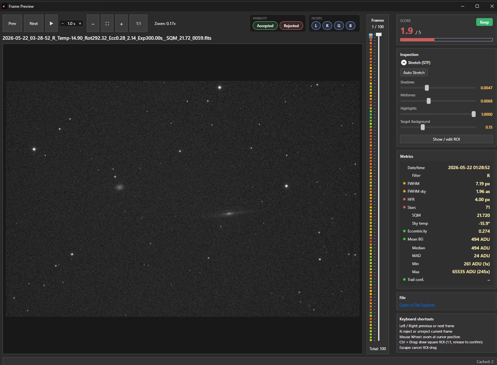

| Control | Action |
|---|---|
| **Left mouse drag** | Pan |
| **Mouse wheel** | Zoom |
| **Right mouse button (hold)** | Show the **loupe** — a small magnifier follows the cursor and displays `X`, `Y`, raw pixel value `K`, plus local `Min`, `Max`, `Mean` |
| **Ctrl + left drag** | Draw a custom square ROI (released = applied; `Esc` cancels) |
| **Prev / Next** buttons | Step through frames |
| **▶ / ⏸** button or `Space` | Start / stop auto-play |
| **− / +** next to play button | Cycle playback speed: 100 ms · 200 ms · 500 ms · **1 s** · 2 s · 3 s · 5 s · 10 s |
| **`1:1`, − / + buttons** | 1:1, zoom out, zoom in |
| **Fit** button | Zoom to fit |
| **Vertical frame slider** | Scrub directly to any frame |
| **Frame markers next to the slider** | Coloured **green → yellow → red** by score, **struck through** for rejected frames, **blue border** for cached frames. **Click any marker** to jump to that frame. The current frame is highlighted in gold. |
| **Open in Explorer** | Opens Windows Explorer with the current file selected |

- Zoom level and pan position are **preserved while stepping** between frames, so you can lock onto a star and watch it across the whole session.
- The window remembers its **size, position, and maximized state** between launches.
- A transient status line appears whenever a full-resolution image is loaded from disk (vs. served from cache).
- The preview window also has its own **Accepted / Rejected** filter chips and a **Skip rejected** toggle so playback can skip over the bad ones.

### FWHM debug overlay (Ctrl+F)

Press **Ctrl+F** in the preview window to toggle a debug overlay that shows exactly which stars were used to compute the per-frame FWHM/HFR statistics. Each star is drawn with a ring sized to its measurement, labelled with its FWHM in pixels and arcseconds, and a summary readout in the top-left of the image shows the star count and median FWHM. This makes it easy to spot saturated stars, faint detections, trailed sources or non-stellar bright patches that might influence the metric.

### Curvature heatmap

Click the **Curvature** toggle in the preview header (next to the zoom level) to replace the raw image with a CCDInspector-style FWHM heatmap built from the per-star measurements. The view shows:

- A smooth color map (background → blue → cyan → green → yellow → orange → red → pink) of FWHM across the entire field, interpolated from the measured stars with a Gaussian kernel.
- A small white **target with crosshair** marking the optical axis at the frame center, so it is obvious where field curvature pulls away from the ideal.
- An overlay panel reporting **Min FWHM**, **Max FWHM**, **Mean FWHM**, **Curvature %** and **Stars Used**. Curvature is computed spatially as `(avg corner FWHM − avg center FWHM) / avg center FWHM × 100`, matching the CCDInspector definition.
- A **live tooltip** at the mouse position showing the interpolated FWHM at that point in pixels and arcseconds, so you can probe edge-vs-center degradation interactively.

Toggling Curvature off restores the normal preview image.

---

## Quality metrics

Every frame is measured for:

| Metric | What it tells you |
|---|---|
| **FWHM (px)** | Star sharpness — lower is better |
| **FWHM (arcsec)** | Same, in sky units (needs focal length + pixel size in the FITS header) |
| **HFR (px)** | Half-flux radius — secondary sharpness measure |
| **Star count** | Drops when clouds roll in or transparency suffers |
| **Eccentricity** | Star roundness — rises with tracking errors, collimation issues, sensor tilt |
| **SQM** | Sky-quality-meter reading (parsed from filename if present) |
| **Sky temperature** | From the `SKYTEMP` FITS keyword — useful as a cloud proxy |
| **Mean background** | Average sky level in ADU |
| **Median / MAD** | Background level and spread |
| **Min / Max** | Including per-value occurrence counters (clipping check) |
| **Satellite trail confidence** | Built-in heuristic, 0–100 % |

Each metric is colour-coded **🟢 / 🟡 / 🔴** relative to the rest of the session, so outliers jump out without having to read numbers.

The following metadata is also extracted: focal length · pixel size · exposure date/time · exposure length · filter name · sky temperature · Bayer pattern (`BAYERPAT`, `XBAYROFF`, `YBAYROFF`).

---

## Automatic rejection

The *Automatic rejection* card has one slider per threshold. Each slider has a live **Rejects: N** counter that updates as you drag it.

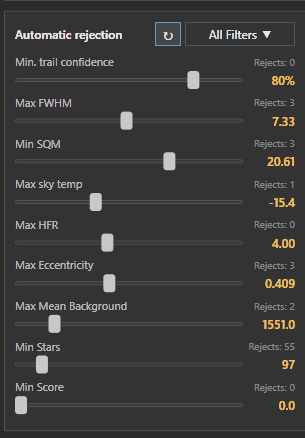

| Threshold | Direction | Default |
|---|---|---|
| Min. trail confidence | min (0 = disabled) | 80 % |
| Max FWHM | max | 8.0 px |
| Min SQM | min | 0 (disabled) |
| Max sky temperature | max | 40 °C |
| Max HFR | max | 4.5 px |
| Max eccentricity | max | 0.60 |
| Max mean background | max | 2000 ADU |
| Min stars | min | 0 (disabled) |
| Min score | min | 0 (disabled) |

You also get:

- A **? badge** on every auto-rejected frame in the list — hover to see exactly which thresholds it violated and by how much (e.g. *FWHM 4.21 px > limit 3.50 px*).
  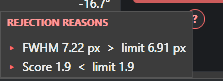
- A **Reject / Keep** button on every row that **overrides the automatic decision**. Manual overrides are independent of the sliders: changing a threshold later does **not** wipe out manual overrides.
  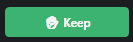

### Per-filter thresholds & scope selector

When your session contains frames from more than one filter (Ha, OIII, L, R, G, B, …), each filter gets its **own independent set of thresholds**. This is essential because, for example, a 600 s Ha sub typically has very different FWHM and background numbers than a 60 s L sub — judging them by the same yardstick would always condemn one or the other.

Right next to the *Automatic rejection* heading you get two extras:
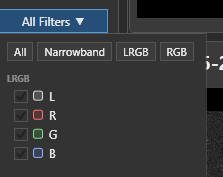
- A **scope selector** dropdown (multi-select). Pick:
  - all filters → slider changes apply to every group at once
  - one filter → tune just that filter; other filters keep their own settings
  - several filters → edit them together

  The button label shows the current scope (*All filters*, *Ha*, *3 filters*, …).
- A **⟳ reset** button. Resets the sliders for the **currently selected** filter group(s) back to the loaded-frame maxima/minima — the same "everything passes" state you start with after loading.

Per-filter slider positions are remembered in the session file, so you don't have to re-tune Ha thresholds every time you reopen a project.

---

## Quality score (0–5)

Every frame gets a quality score from **0.0** (worst) to **5.0** (best), shown as a number, a star rating, and a label:

| Label | Score | Meaning |
|---|---|---|
| **GOOD** | ≥ 4.0 | Top tier of the session |
| **FAIR** | 2.0 – 3.9 | Average |
| **POOR** | < 2.0 | Bottom tier |

### How it works

The score is **relative within the session, per filter**. That means:

- The best frame in your session for a given filter scores near **5.0**, the worst near **0.0** — the full scale is always used.
- Ha frames are ranked against other Ha frames, OIII against OIII, L against L, and so on, so narrowband and broadband subs are always judged against their true peers.

Internally each metric is rank-percentiled (1.0 = best in its group, 0.0 = worst), then combined with these weights:

| Metric | Weight | Why |
|---|---|---|
| FWHM | 3.0 | Sharpness — most impactful on resolved detail |
| Eccentricity | 2.5 | Star roundness — tracking / collimation / tilt |
| Satellite trail confidence | 2.0 | Frames with detected trails score lower |
| HFR | 1.5 | Secondary sharpness check |
| Star count | 1.5 | Transparency / clouds proxy |
| Mean background | 0.5 | Light pollution / gradient |

The weighted percentiles are averaged and scaled to 0–5.

> **Caveat:** because the score is relative, the same physical frame can score differently in different sessions — just like a podium spot depends on who else is competing. Scores are not comparable across sessions.

---

## Region of Interest (ROI)

The ROI is a small square crop of each frame, shown next to its full-frame thumbnail. It exists so you can judge fine detail (star shapes, faint structure) without zooming in on each frame individually.

- **Automatic placement** — on load, the ROI is positioned automatically using a center-aware, content-aware algorithm that prefers regions with high local contrast and extended structure. It works across galaxies, globular clusters, nebulae, and starfields without any configuration, and it is far less likely to lock onto plain background or a single bright star than naive algorithms.
- **Automatic sizing** — the ROI is sized in preview-pixel terms (~2.5× downsample into the 160 px thumbnail), so stars and fine structure stay visible in the list preview regardless of image scale.
- **Interactive ROI overlay (preview window)** — toggle **Show / edit ROI** in the preview pane to overlay the current ROI as a golden dotted square on top of the image. While it's visible, you can:
  - **Drag the square** to move it.
  - **Drag any corner** to resize it (locked to a 1:1 pixel-square aspect).
  - **Release the mouse** — or **right-click the ROI** — to apply it to every frame and regenerate all ROI thumbnails immediately.
- **Ctrl + left drag** in the preview window draws a brand-new ROI from scratch. Press **Escape** to cancel an in-progress drag.
- The ROI applies to **all frames** at once, and frames with different orientation (meridian-flipped, rotated) are automatically aligned first so the ROI lands on the same patch of sky.

---

## Stretch (Shadows / Midtones / Highlights)

Each frame is rendered with a **Screen Transfer Function (STF)** stretch. You get four sliders in the *Stretch* card:

| Slider | Effect |
|---|---|
| **Shadows** | Black point |
| **Midtones** | Gamma / midtone bend |
| **Highlights** | White point |
| **Target background** | Target background level for the automatic stretch |

Two more toggles:

- **Auto-stretch per frame** — when on, the STF parameters are recomputed independently per frame (good when frame backgrounds vary a lot). When off, a fixed global stretch is used.
- **Same-background normalization** — aligns every frame to a common target background level so the blink comparison isn't confused by varying sky brightness. The target is the *Target background* slider value.

OSC (one-shot colour) frames use **unlinked colour stretch**: shadows, midtones, and highlights are computed independently per R/G/B channel so colour balance is naturally preserved without manual white balance.

> Moving **Shadows / Midtones / Highlights** automatically switches the preview into manual stretch mode so your adjustments are immediately visible. The **Target background** slider continues to drive the automatic stretch as before.

The same controls live in both the main window and the preview window.

---

## Frame summary & filter chips

The *Frame summary* card on the left sidebar gives you a live read of session health:

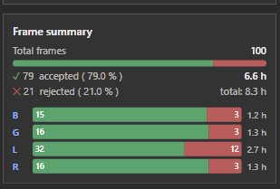

- **Total frames** matching the active filter selection.
- An **accepted / rejected ratio bar** — green = accepted, red = rejected.
- **Accepted count** + percentage + accepted integration time (e.g. `2.4 h`).
- **Rejected count** + percentage + total integration time (e.g. `total: 3.2 h`).
- A **per-filter breakdown** (when multiple filters are present): one row per filter with name, mini ratio bar, accepted/total/% summary, and accepted integration time.

### Visibility toggles

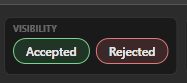
- **Show Accepted** — hide accepted frames from the list (useful when you want to focus on what's about to be rejected).
- **Show Rejected** — hide rejected frames from the list.

These only affect the list display — the *Frame summary* counts always reflect the full filter selection.

### Filter chips
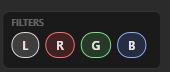

Below the visibility toggles, one chip per filter found in your session. Tick / untick to include / exclude frames of that filter from the list.

### Sorting
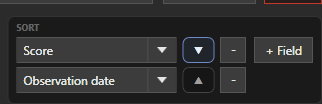

Stack multiple sort rules in the *Sort* card. You can sort by any metric column or by **Score**. Use **−** to remove a rule and **+** to add another. Default sort is *Observation time, ascending*. Sorting in the main window and the preview window is kept in sync.

---

## Watch Folder (live mode)

Enable **Watch Folder** in the Open Folder panel (the checkbox sits just below *Include Subfolders*) before or after clicking **Load Frames**.

Once frames have loaded and the option is ticked, Rejector starts a `FileSystemWatcher` on every input folder path. When a new `.fit`, `.fits`, or `.xisf` file appears:

1. Rejector waits 1.5 seconds for the capture software to finish writing the file.
2. The file is loaded, oriented relative to the first frame, and all quality metrics are computed — exactly the same pipeline as the initial bulk load.
3. The frame is appended to the bottom of the list, filter chips are updated, and rejection thresholds are applied immediately.
4. The status bar shows a confirmation line: `Watch: added NGC7000_L_042.fits — 42 frame(s) total.`

A blinking red **LIVE** badge in the status bar shows that watching is active. It disappears as soon as you untick **Watch Folder** or start a new **Load Frames** operation.

> **Tip:** Leave Rejector open during a long imaging session with **Watch Folder** on. Each new frame will be graded automatically — you can spot a cloud rolling in or a bad seeing run without touching the keyboard.

> **Note:** The watcher monitors the file system in real time but does *not* replace a manual reload. If you change the input folder path or toggle *Include Subfolders* while watching is active, click **Load Frames** again to rescan from scratch.

---

## Moving rejected frames

When you're happy with the verdicts:

1. Set the **Rejected folder** in the top toolbar (or via *Browse*).
2. Click the **Reject** button in the top toolbar.
3. A confirmation dialog appears showing how many frames will be moved and the destination path.
   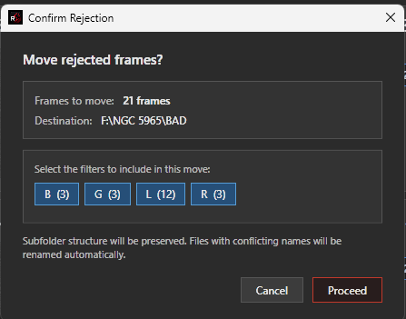
4. If your session contains multiple filters, the dialog shows a per-filter chip row (e.g. `Ha  (12)`). Untick a chip to exclude that filter's frames; the *Frames to move* count updates live, and *Proceed* is disabled if zero frames would be moved.
5. Click **Proceed** to perform the move; **Cancel** aborts.

Behaviour:

- **Subfolder structure is preserved.** A frame at `input/night1/foo.fits` ends up at `rejected/night1/foo.fits`.
- **Collisions are renamed**, not overwritten — `_1`, `_2`, … is appended to the filename as needed.
- Moved frames are **removed from the current list** automatically.

---

## Saving & loading sessions

Use the icons in the top-left corner of the toolbar:

- **💾 Save Session** — writes a `.boms` file containing **everything** about your current session: input/rejected folder paths, the *Subfolders* toggle, all per-filter rejection thresholds, STF settings, manual ROI rectangle, sort rules, filter chip selection, accepted/rejected state for every frame, all extracted metrics, FITS metadata, plus the thumbnail and ROI images embedded as PNGs. No re-analysis is required when you reopen it.
- **📂 Load Session** — restores a `.boms` file instantly. Then the input folder is rescanned and any **new** files (not already in the session) are loaded and appended automatically. This makes it easy to add fresh subs to an in-progress culling session.

Sessions from older versions of Rejector are loaded with a sensible fallback for any fields that have been added since.

---

## Keyboard shortcuts

| Key | Where | Action |
|---|---|---|
| `Space` | Preview window | Toggle play / pause |
| `←` / `→` | Preview window | Previous / next frame |
| `R` | Preview window | Toggle reject on the current frame |
| `Ctrl+F` | Preview window | Toggle FWHM debug overlay (per-star rings + labels) |
| `Esc` | Preview window | Cancel an in-progress ROI drag |
| `Ctrl` + left drag | Preview window | Draw a new manual ROI |
| Right mouse (hold) | Preview window | Loupe — local pixel stats |

---

## Headless / command-line mode

Rejector can also run without a UI, useful for scripted pipelines.

```powershell
rejector -- `
  --headless `
  --input    "D:\lights" `
  --rejected "D:\lights\rejected" `
  --max-fwhm 5.5 `
  --max-hfr  3.5 `
  --max-ecc  0.55 `
  --max-bg   1800
```

All threshold arguments are optional; omitting one keeps its default value.

| Argument | Description | Default |
|---|---|---|
| `--headless` | Run without UI (required) | — |
| `--input <folder>` | Source frames folder | — |
| `--rejected <folder>` | Destination folder for rejected frames | — |
| `--max-fwhm <value>` | Reject frames with FWHM above this value (px) | `8.0` |
| `--max-hfr <value>` | Reject frames with HFR above this value (px) | `4.5` |
| `--max-ecc <value>` | Reject frames with eccentricity above this value | `0.6` |
| `--max-bg <value>` | Reject frames with mean background above this value (ADU) | `2000` |
| `--allow-trails` | Disable satellite-trail rejection | trails rejected at ≥ 80 % |

> `--min-sqm`, `--min-stars`, `--max-sky-temp`, and `--min-trail-confidence` are currently GUI-only.

---

## Notes & caveats

- All metrics, trail detection, ROI selection, scoring, and orientation normalization are **heuristic** and tuned for speed, not scientific precision. Rejector is designed for fast subframe culling, not final calibration.
- Loupe pixel stats are derived from the **stretched preview image**, not raw sensor data.
- Manual keep / reject overrides are independent of the auto-rejection sliders — changing a threshold after a manual override does not clear the override.
- Move operations rename on collision (`_1`, `_2`, …) so no file is ever overwritten.
- The quality score is **relative to the current session and to the frame's filter group** — the same frame can score differently in different sessions.

---

## Requirements

- **Windows 10 or later** (the UI is WPF; the headless mode is also Windows-only).
- **.NET 10** runtime. The installer bundles what it needs.

---

## Changelog

See [CHANGELOG.md](CHANGELOG.md) for the full version history.
